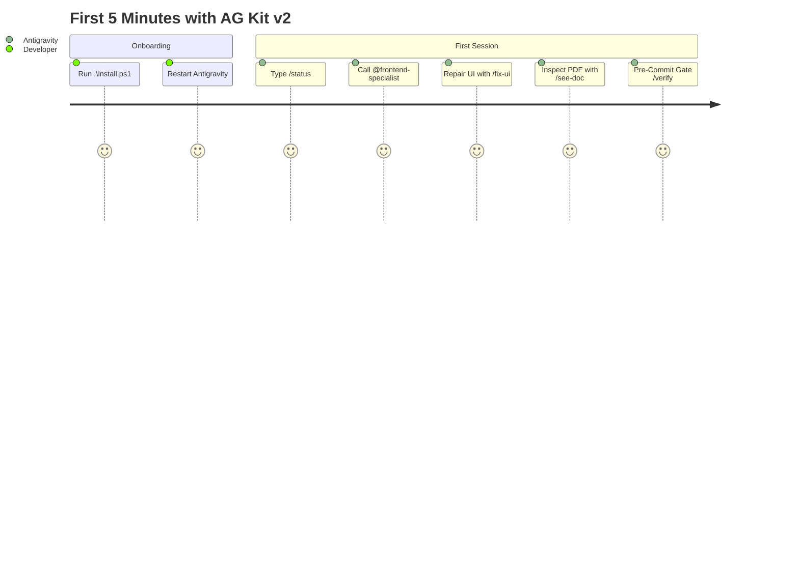
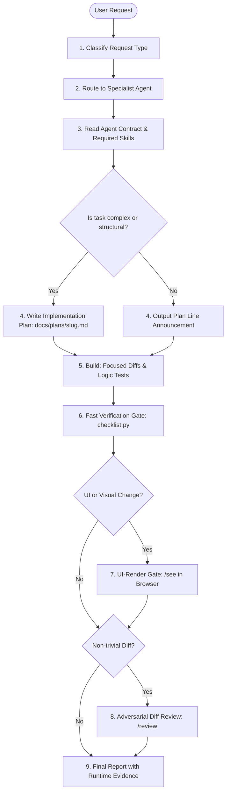

# AG Kit v2

[](./VERSION)
[](./LICENSE)
[](https://github.com/KeithTorda/agkit2)
[](./scripts/validate_kit.py)
[](./scripts/tests/test_toolkit.py)

**AG Kit v2** is a high-rigor agentic engineering framework designed specifically for **Google Antigravity (AGY)**. It transforms the AI assistant into an autonomous pair of principal engineers by enforcing deterministic request routing, specialist agent isolation, an ordered four-phase execution protocol, mandatory runtime verification gates, and accessible design invariants.

Maintained by [@KeithTorda](https://github.com/KeithTorda). Rebuilt on top of `vudovn/ag-kit` and redesigned for production software delivery on modern tech stacks.

---

## ⚡ Quick Start: 60-Second Installation

> [!TIP]
> AG Kit v2 requires **zero manual configuration**. You can install it via Git or as a direct 1-click ZIP download.

### Option 1: Git Clone (Recommended)

Open **PowerShell** and run:

```powershell
git clone https://github.com/KeithTorda/agkit2.git
cd agkit2
.\install.ps1
```

### Option 2: 1-Click ZIP Download (No Git Required)

1. **[Click here to download AG Kit v2 (.zip)](https://github.com/KeithTorda/agkit2/archive/refs/heads/main.zip)**
2. Extract the downloaded `agkit2-main.zip` folder.
3. Open PowerShell inside the extracted folder and run:
   ```powershell
   .\install.ps1
   ```

> [!NOTE]
> **PowerShell Execution Policy**: If Windows blocks running the script with an execution policy error, run this first:
> ```powershell
> Set-ExecutionPolicy -Scope Process -ExecutionPolicy Bypass
> .\install.ps1
> ```

---

## 🎓 Tutorial: Your First 5 Minutes with AG Kit v2

Once `.\install.ps1` completes with `[PASS] Toolkit is structurally valid`, **restart Google Antigravity IDE** and open any project workspace. You are ready to pair-program with 17 specialist agents!



### 1. Check System Telemetry & Gate Health (`/status`)
Type into the Antigravity chat:
```text
/status
```
- **What happens**: Antigravity runs the status skill, summarizing your active tech stack, Git diffs, test suite status, open task blueprints, and active specialist subagents without modifying any files.

### 2. Summon a Specialist Persona (`@<agent>`)
Rather than relying on generic AI, summon an engineer dedicated to a specific domain:
```text
@frontend-specialist create a high-contrast dark theme student roster table with glowing emerald status badges
```
- **What happens**: The assistant announces its formal plan line:
  `@frontend-specialist · skills: frontend-design, browser-verification · steps: screen read → build → checklist → /see → report`
  It adheres strictly to the **Ultra High-Contrast standard** (`#FFFFFF` text on dark surfaces, pure `#000000` on light surfaces, and radiant status badges in `@layer components`).

### 3. Container-First UI Layout Repair (`/fix-ui`)
When a component looks misaligned, overlaps, or breaks on mobile:
```text
/fix-ui student table headers overlap on mobile viewport
```
- **What happens**: The `/fix-ui` skill opens the app in a headless browser, captures before-and-after screenshots to `.agents/verify/<task-slug>/`, identifies the parent container layout constraints, and fixes the root cause at the source. It strictly bans `!important` or hacky wrapper elements.

### 4. Inspect Downloadable Documents & Reports (`/see-doc`)
When building features that output printable forms, PDF receipts, or Excel spreadsheets:
```text
/see-doc verify the exported voter certificate PDF layout
```
- **What happens**: Runs `scripts/doc_verify.py` to inspect rendered pages, verify embedded vector fonts, check glyph integrity, ensure printable margin clearances, and visual-diff against government or official blank templates.

### 5. Run Automated Pre-Commit Verification Gates (`/verify`)
Before committing changes or creating a pull request:
```text
/verify
```
- **What happens**: Automatically executes the fast gate (`checklist.py`), scanning for OWASP Top 10 vulnerabilities, TypeScript compilation errors, linter violations, CSS collisions (`css_audit.py`), and test suite regressions.

---

## Table of Contents

- [⚡ Quick Start: 60-Second Installation](#-quick-start-60-second-installation)
- [🎓 Tutorial: Your First 5 Minutes with AG Kit v2](#-tutorial-your-first-5-minutes-with-ag-kit-v2)
- [Why AG Kit v2?](#why-ag-kit-v2)
- [Architecture & Life of a Request](#architecture--life-of-a-request)
- [The 7 Global Invariant Rules](#the-7-global-invariant-rules)
- [Ultra High-Contrast Typography Standard](#ultra-high-contrast-typography-standard)
- [Slash Commands Reference](#slash-commands-reference)
- [Specialist Agent Roster](#specialist-agent-roster)
- [Automated Verification Gates](#automated-verification-gates)
- [Installation Guide & Deep Dive](#installation-guide--deep-dive)
- [Project Memory & Customization](#project-memory--customization)
- [Toolkit Maintenance & Testing](#toolkit-maintenance--testing)
- [Technology Baseline](#technology-baseline)
- [License & Credits](#license--credits)

---

## Why AG Kit v2?

Standard coding assistants suffer from recurring failure modes: shallow analysis, generic styling, unverified assertions ("fixed!"), unreadable low-contrast text, and sprawling functions. AG Kit v2 replaces guesswork with disciplined engineering invariants:

| Capability | Vanilla AI Prompting | Generic System Prompts | AG Kit v2 Architecture |
| :--- | :--- | :--- | :--- |
| **Domain Ownership** | Single model handles all tasks uniformly | Loose persona definitions | **17 Specialist Agents** with strict file ownership |
| **Execution Process** | Implements immediately upon reading prompt | Unstructured text responses | **Canonical 4-Phase Protocol** (Analyze → Plan → Build → Verify) |
| **Verification** | Claims success without running code | Basic build check | **Mandatory Gates** (`checklist.py` scanning types, lint, tests, security) |
| **Visual UI Quality** | Unchecked hallucinated markup | Static CSS file inspection | **Live UI-Render Gate (`/see`)** via headless browser DOM/CSS audit |
| **Typography & Contrast** | Faded gray text (`#94a3b8`) on dark backgrounds | Inconsistent manual styling | **Anti-Blur Invariant** (Pure `#FFFFFF` on dark, Pure `#000000` on light) |
| **Diff Critique** | Optimistic self-confirmation | None | **Adversarial Diff Attack (`/review`)** hunting edge cases and leaks |
| **Context Retention** | Lost between session resets | None | **Persistent Project Memory** (`.agents/memory/MEMORY.md`) |

---

## Architecture & Life of a Request

Every prompt submitted to Antigravity runs through an ordered, deterministic pipeline:



### The 4 Execution Phases

1. **ANALYZE**: Reads active files, dependents, project `DESIGN.md`, and memory. Questions are asked only if architectural ambiguity changes the build.
2. **PLAN**: For complex features or new applications, produces a verifiable blueprint in `docs/plans/{task-slug}.md` containing owner-assigned checkboxes and verify commands.
3. **BUILD**: Writes concise code adhering to strict limits (max 30 lines per function, max nesting depth 3, zero dead code). Logic changes must include automated tests.
4. **VERIFY**: Runs automated gate suites. Never reports "done" without concrete exit codes, test outputs, or live browser verification evidence.

---

## The 7 Global Invariant Rules

The kit installs 7 always-on rules into `~/.gemini/config/rules/` that govern every interaction:

1. **[`core-protocol.md`](./rules/core-protocol.md)**: Defines the required 9-step sequence. Mandates that every code response begins with the plan line:
   ```text
   @<agent> · skills: <a>, <b> · steps: <step 1> → <step 2> → <step 3>
   ```
2. **[`code-rules.md`](./rules/code-rules.md)**: Establishes the Definition of Done. Differentiates required blocking checks (P0) from advisory reports (P1–P4). Governs the mandatory UI-render gate.
3. **[`design-rules.md`](./rules/design-rules.md)**: Defines UI design invariants, anti-default heuristics, and the Ultra High-Contrast standard.
4. **[`engineering-excellence.md`](./rules/engineering-excellence.md)**: Requires solving the root problem behind the prompt, anticipating edge-case failures, and conducting hostile diff reviews.
5. **[`request-routing.md`](./rules/request-routing.md)**: Evaluates user intent to select the correct specialist agent and dispatch table.
6. **[`universal-rules.md`](./rules/universal-rules.md)**: Enforces concise, professional responses with zero filler, no emojis, strict memory loading, and host safety.
7. **[`quick-reference.md`](./rules/quick-reference.md)**: Machine-generated catalog of all agents, skills, slash commands, and audit script paths.

---

## Ultra High-Contrast Typography Standard

A common defect in AI-generated web interfaces is low-contrast, washed-out typography—such as Slate-400 (`#94A3B8`) text over dark navy cards—which causes eye strain and fails accessibility guidelines.

AG Kit v2 enforces the **Ultra High-Contrast Typography & Badges (Anti-Blur Invariant)**:

- **Dark Theme Primary Text**: Must be Pure White (`#FFFFFF`). Secondary and table body text must be high-luminance (`#F1F5F9` / `#E2E8F0`), delivering a 10:1+ contrast ratio.
- **Light Theme Primary Text**: Must be Pure Black (`#000000`) or deep Slate-950 (`#020617`).
- **Radiant Status Badges**: Dark-on-dark colored text is prohibited. Status badges on dark surfaces must use luminous foregrounds (e.g. Emerald `#34D399`) with semi-transparent tinted backgrounds and borders.
- **CSS Architecture Layering**: Reusable cards, buttons, and status badges must be encapsulated in Tailwind's `@layer components` to avoid specificity collisions with utility overrides:

```css
@layer components {
  /* High-contrast dark surface */
  .dark .ui-card {
    background-color: #0B132B;
    border: 1px solid rgba(255, 255, 255, 0.12);
    color: #FFFFFF;
  }
  
  /* Radiant glowing status badge */
  .dark .status-active {
    background-color: rgba(16, 185, 129, 0.15);
    border: 1px solid rgba(52, 211, 153, 0.4);
    color: #34D399;
    font-weight: 700;
  }
}
```

---

## Slash Commands Reference

AG Kit v2 provides 15 primary workflow commands:

| Command | Lifecycle Phase | Description | Example Usage |
| :--- | :--- | :--- | :--- |
| **`/create`** | Project Scaffolding | Scaffolds a complete project from natural-language specs with interview, plan, `DESIGN.md`, and dev server. | `/create voter registration app with Vite and SQLite` |
| **`/plan`** | Implementation Design | Formulates an architectural blueprint in `docs/plans/{task-slug}.md` before writing code. | `/plan biometric voter authentication flow` |
| **`/brainstorm`** | Architecture Exploration | Compares 2–4 technical alternatives with trade-offs and recommendations. | `/brainstorm SSE vs WebSockets for real-time counts` |
| **`/debug`** | Problem Resolution | 4-phase systematic debugging: Reproduce → Isolate → Root Cause → Regression Test & Fix. | `/debug precinct map crashes on mobile tap` |
| **`/fix-ui`** | Layout Repair | Container-first diagnosis of broken/misaligned web UI without layout overrides. | `/fix-ui sidebar overlaps main content on tablet` |
| **`/verify`** | Pre-Commit Quality | Runs security scans, TypeScript compiler, linter, tests, and build check to prove code works. | `/verify ensure all changes pass security and lint gates` |
| **`/see`** | Visual Inspection | Opens running app in a headless browser to inspect DOM, computed styles, and responsive states. | `/see check login form and roster table in dark mode` |
| **`/see-doc`** | Document Inspection | Renders generated PDF documents to inspect fonts, glyph survival, margins, and template alignment. | `/see-doc verify voter registration certificate layout` |
| **`/review`** | Adversarial Review | Hostile review of current diff hunting for edge cases, error paths, races, and security risks. | `/review check authentication middleware refactor` |
| **`/deploy`** | Production Release | Pre-flight validation, artifact build, SSH/SFTP deployment, and live health verification. | `/deploy ship build to production VPS on port 80` |
| **`/enhance`** | Feature Expansion | Adds or updates features in an existing codebase preserving established patterns. | `/enhance add PDF export to student roster table` |
| **`/orchestrate`**| Multi-Agent Build | Coordinates parallel specialist subagents across frontend, backend, database, and test domains. | `/orchestrate build election audit logging system` |
| **`/test`** | Test Engineering | Generates, executes, or fixes unit, integration, and Playwright end-to-end test suites. | `/test add regression tests for theme toggle button` |
| **`/status`** | Repository Telemetry | Summarizes git diffs, open plan tasks, and required check states without altering code. | `/status summarize all changes made in this session` |
| **`/remember`** | Persistent Memory | Saves durable preferences, conventions, or decisions to `.agents/memory/MEMORY.md`. | `/remember always run Nginx reverse proxy on port 80` |

For the full catalog of 34 domain skills (including `/frontend-design`, `/database-design`, `/nodejs-best-practices`, `/document-generation`), see [`AG_KIT_SLASH_COMMANDS.md`](./AG_KIT_SLASH_COMMANDS.md).

---

## Specialist Agent Roster

Work is allocated to 17 specialist personas, each with defined file ownership and responsibilities:

| Specialist Agent | Owned File Domains | Core Competencies |
| :--- | :--- | :--- |
| `frontend-specialist` | `src/components/`, `pages/`, `views/`, UI assets | Web UI, responsive layouts, accessibility, state tiers |
| `backend-specialist` | `src/api/`, `controllers/`, `routes/`, server logic | REST/tRPC/GraphQL APIs, middleware, queues, auth |
| `database-architect` | `prisma/`, `migrations/`, `schema.sql`, database logic | Schema modeling, indexing, query optimization, UUIDv7 |
| `mobile-developer` | `ios/`, `android/`, React Native / Flutter components | Mobile gestures, native modules, thumb zones, offline |
| `devops-engineer` | `Dockerfile`, `.github/workflows/`, deploy scripts | CI/CD pipelines, Docker, VPS, Nginx, PM2, rollbacks |
| `security-auditor` | Security audit reports, auth configs, boundary guards | OWASP Top 10, secret scanning, dependency CVE triage |
| `penetration-tester` | Authorized security test harnesses, threat simulations | MITRE ATT&CK vectors, attack path modeling |
| `test-engineer` | `tests/`, `__tests__/`, `*.spec.ts`, `e2e/` | Unit testing, integration suites, Playwright automation |
| `performance-optimizer`| Bundles, profiling configs, lazy-loading boundaries | Core Web Vitals (LCP, INP, CLS), memory leak analysis |
| `debugger` | Bug-reproducing fixtures, stack trace diagnoses | Root cause isolation, regression test creation |
| `explorer-agent` | Read-only survey reports, codebase maps | Brownfield exploration, architectural discovery |
| `code-archaeologist` | Legacy codebases, refactoring targets | Legacy modernization, technical debt reduction |
| `orchestrator` | Overall multi-agent execution plans | Parallel subagent delegation, file-isolation management |
| `project-planner` | `docs/plans/`, roadmap specifications | Scope definition, milestone tracking, task breakdown |
| `product-manager` | `docs/prd/`, requirement specifications | User stories, acceptance criteria, MVP prioritization |
| `seo-specialist` | `sitemap.xml`, `robots.txt`, structured data | JSON-LD, technical SEO, Generative Engine Optimization |
| `documentation-writer`| `README.md`, `docs/`, OpenAPI specs, ADRs | Technical documentation, architecture decision records |

---

## Automated Verification Gates

AG Kit v2 integrates 23 automated Python verification scripts. The primary gate is executed via:

```powershell
python scripts/checklist.py <project-path>
```

### Gate Hierarchy

```
                                 [ checklist.py ]
                                        │
           ┌────────────────────────────┴────────────────────────────┐
           ▼                                                         ▼
   [ Required (P0) ]                                         [ Advisory (P1-P4) ]
   Blocks "Done" Status                                      Reported for Information
   ├── Security Scan (High+ CVEs)                             ├── UX & Styling Audit
   ├── TypeScript Compilation                                 ├── Accessibility Heuristics
   ├── Linter (ESLint 9 / Ruff / Pint)                        ├── SEO & GEO Schema Check
   └── Test Suite (Unit & Integration)                        └── Bundle Size & Performance
```

- **Required Checks (P0 - Blocking)**: Failures trigger the auto-fix policy. The assistant must resolve issues before reporting completion.
- **Advisory Checks (P1–P4 - Non-blocking)**: Reported to the user as recommendations without blocking the task.
- **UI-Render Gate**: For changes affecting rendered UI, the `/see` visual check must be executed against the running dev server.

---

## Installation Guide & Deep Dive

### Prerequisites
- **Operating System**: Windows 11 (PowerShell 7 / `pwsh` recommended) or macOS / Linux
- **Runtimes**: Python 3.12+ and Node.js 20+ on `PATH`
- **IDE**: Google Antigravity (AGY) v2.0+

### File Distribution Architecture

When you run `.\install.ps1`, it automatically provisions your Antigravity user environment:

```
~/.gemini/config/
├── plugins/
│   └── ag-kit-v2/                 # Core toolkit engine
│       ├── agents/                # 17 specialist agent contracts (.md)
│       ├── skills/                # 34 domain skills & sub-references
│       └── scripts/               # 27 verification scripts & audit tools
└── rules/                         # 7 always-on invariant rules
    ├── core-protocol.md           # 9-step canonical execution order
    ├── code-rules.md              # Gates, auto-fix policy, fix-at-source
    ├── design-rules.md            # High-contrast standard, layout heuristics
    ├── engineering-excellence.md  # Root-cause analysis, adversarial critique
    ├── request-routing.md         # Request classifier & routing table
    ├── universal-rules.md         # No filler, host safety, memory loading
    └── quick-reference.md         # Machine-generated catalog of all tools
```

### Automated Installation (PowerShell)

From the root of this cloned or extracted repository:

```powershell
.\install.ps1
```

The script automatically:
1. Provisions directories at `$env:USERPROFILE\.gemini\config\plugins\ag-kit-v2` and `$env:USERPROFILE\.gemini\config\rules`.
2. Copies all specialist agents, skills, and verification scripts.
3. Installs the 7 global invariant rules.
4. Rewrites hardcoded file paths dynamically to match your current Windows user profile (`$env:USERNAME`).
5. Runs `validate_kit.py` to confirm structural integrity (0 errors, 0 warnings).

### Manual Installation

If you prefer to configure manually or are on macOS / Linux:

```powershell
# 1. Copy plugin files
Copy-Item -Path ".\*" -Destination "$env:USERPROFILE\.gemini\config\plugins\ag-kit-v2" -Recurse -Force -Exclude "rules", ".git", "install.ps1", "README.md"

# 2. Copy global rules
Copy-Item -Path ".\rules\*" -Destination "$env:USERPROFILE\.gemini\config\rules" -Recurse -Force

# 3. Validate installation
python "$env:USERPROFILE\.gemini\config\plugins\ag-kit-v2\scripts\validate_kit.py"
```

### Updating AG Kit v2

To update to the latest version of AG Kit v2:

```powershell
# In your cloned agkit2 repository:
git pull origin main
.\install.ps1
```
*If you downloaded via ZIP, simply download the latest ZIP, extract, and run `.\install.ps1` to overwrite existing files with new updates.*

### Troubleshooting

- **PowerShell Script Blocked (`UnauthorizedAccess`)**:
  Run `Set-ExecutionPolicy -Scope Process -ExecutionPolicy Bypass` in your PowerShell window, then re-run `.\install.ps1`.
- **Python / Node Not Found**:
  Ensure Python (3.12+) and Node.js are added to your system `PATH`. Verify by typing `python --version` and `node --version` in terminal.
- **Antigravity Doesn't Pick Up Commands**:
  Restart Google Antigravity IDE after running `install.ps1`. The IDE loads customizations at startup.

---

## Project Memory & Customization

### Per-Project Memory
Create an `.agents/memory/MEMORY.md` file in any project root to store durable project context:

```markdown
# Project Memory

## Technical Decisions
- 2026-09-06: Production VPS runs Nginx reverse proxy routing port 80 to port 3000.

## Conventions
- Use UUIDv7 for all primary keys in SQLite and PostgreSQL.
- Primary card text must strictly use #FFFFFF in dark mode.

## [failure] Dead Ends
- Attempted client-side CSV parsing on mobile; crashed memory. Use backend streaming endpoint instead.
```

When this file exists, Antigravity reads it at session start and avoids previously documented dead ends. Use `/remember <note>` to add entries interactively.

---

## Toolkit Maintenance & Testing

When modifying agents, skills, or scripts within the toolkit:

```powershell
# 1. Structural and cross-reference validation
python scripts/validate_kit.py

# 2. Execute unit test suite (15 test cases)
python -m unittest discover -s scripts/tests

# 3. Regenerate quick-reference catalog after updating skills or agents
python scripts/build_quick_reference.py --write
```

---

## Technology Baseline

Specialist agents and skills target the following modern tech stack baseline:

- **Web Frontend**: Next.js 16 (App Router, Turbopack default), React 19.2 (React Compiler ready), TypeScript 5.9+, Tailwind CSS v4 (`@theme`), `motion/react`.
- **Backend & APIs**: Node.js 24 LTS, Hono (preferred for standalone microservices), Fastify, Python 3.14 (async, FastAPI, Pydantic v2), PHP 8.4 / Laravel 12 (Pest, Pint, Larastan).
- **Databases & ORMs**: PostgreSQL 17/18, SQLite, Prisma 7, Drizzle ORM, Eloquent, UUIDv7.
- **Testing**: Vitest, Jest, Pest, PHPUnit, Playwright E2E.
- **Security**: OWASP Top 10:2025 compliance, token rotation, automated CVE analysis.

---

## License & Credits

- Based on the upstream project [vudovn/ag-kit](https://github.com/vudovn/ag-kit).
- Rebuilt, modernized, and maintained by [Keith Torda](https://github.com/KeithTorda).
- Licensed under the [MIT License](./LICENSE).