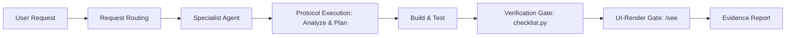

# AG Kit v2

[](./VERSION)
[](https://opensource.org/licenses/MIT)
[](https://github.com/KeithTorda/agkit2)
[](./scripts/validate_kit.py)

**AG Kit v2** is a modular, high-rigor engineering toolkit designed for **Google Antigravity (AGY)**. It equips the assistant with 17 domain-specialist agents, 44 workflow skills, 13 interactive slash commands, 23 automated audit scripts, and global architectural rules.

Maintained by [@KeithTorda](https://github.com/KeithTorda). Rebuilt on top of `vudovn/ag-kit` and re-architected for production-grade software delivery, accessibility standards, and strict verification gates.

---

## Architecture & Core Concepts

AG Kit v2 enforces a disciplined four-phase execution pipeline on every request:



1. **Deterministic Request Routing**: Evaluates user prompts against global routing matrices to assign the exact specialist agent rather than generic LLM handlers.
2. **Canonical Phase Model**:
   - **ANALYZE**: Reads active code, dependent modules, and project `DESIGN.md`.
   - **PLAN**: Produces verifiable task blueprints (`docs/plans/{task-slug}.md`) for complex tasks.
   - **BUILD**: Implements focused, self-documenting code with unit tests for logic changes.
   - **VERIFY**: Executes required automated gates (security high+, lint, types, tests) and produces verifiable runtime evidence.
3. **UI-Render Gate (`/see`)**: Changes affecting rendered UI require real headless browser verification—validating rendered DOM, computed CSS tokens against `DESIGN.md`, console errors, and interaction responsive states.
4. **Ultra High-Contrast Standards**: Implements strict monochromatic anti-blur invariants across all interfaces—pure white text (`#FFFFFF`) on dark surfaces and pure black (`#000000`) on light surfaces, eliminating illegible washed-out grays and ensuring maximum readability.

---

## Slash Command Catalog

All commands map directly to executable Antigravity skills:

| Command | Action | Primary Output |
| :--- | :--- | :--- |
| `/create` | Scaffolds a complete project from natural-language specs | Requirements interview, `docs/plans/`, `DESIGN.md`, baseline app |
| `/plan` | Formulates a structured implementation plan | Verifiable task checklist in `docs/plans/{task-slug}.md` |
| `/brainstorm` | Compares 2–4 technical or architectural alternatives | Comparative trade-off matrix and recommended path |
| `/debug` | Investigates and resolves complex system anomalies | Reproduce → Isolate → Root Cause → Regression Test & Fix |
| `/verify` | Validates codebase health and runtime integrity | Required checks pass/fail report with console evidence |
| `/see` | Inspects live browser render of the running web application | Rendered DOM analysis, computed styles, visual verification |
| `/review` | Adversarial code review of the current diff | Concrete defect analysis ranked by blast radius |
| `/deploy` | Executes verified deployments to preview or production | Pre-flight check, zero-downtime release, rollback runbook |
| `/enhance` | Extends features in an existing brownfield project | Scoped implementation preserving established conventions |
| `/orchestrate` | Coordinates multi-domain tasks across specialist subagents | Parallel research and execution with single synthesis report |
| `/test` | Executes, updates, or generates automated test suites | Test coverage matrix and regression validation |
| `/status` | Assesses repository state without modifying code | Open plan tasks, required check states, and git diffs |
| `/remember` | Records durable conventions and decisions across sessions | Persistent index in `.agents/memory/MEMORY.md` |

For an in-depth reference of all specialist domain skills, see [`AG_KIT_SLASH_COMMANDS.md`](./AG_KIT_SLASH_COMMANDS.md).

---

## Specialist Agents

AG Kit v2 distributes responsibilities across 17 specialist agents, each owning distinct file domains and toolchains:

| Agent | Responsibility Domain | Primary Skills |
| :--- | :--- | :--- |
| `frontend-specialist` | Web UI, responsive layouts, components, client state | `frontend-design`, `browser-verification`, `frontend-architecture` |
| `backend-specialist` | APIs, server logic, webhooks, auth, background queues | `nodejs-best-practices`, `python-patterns`, `api-patterns` |
| `database-architect` | Schemas, SQL, migrations, indexing, query optimization | `database-design` |
| `mobile-developer` | React Native (Expo) and Flutter applications | `mobile-design`, `testing-patterns` |
| `devops-engineer` | CI/CD pipelines, Docker, VPS, Nginx, PM2, deployments | `shell-ops`, `clean-code` |
| `security-auditor` | OWASP Top 10 vulnerabilities, auth flows, secrets | `vulnerability-scanner`, `clean-code` |
| `penetration-tester` | Authorized security attack simulation and red-team testing | `red-team-tactics` |
| `test-engineer` | Unit, integration, coverage, and Playwright E2E testing | `testing-patterns`, `clean-code` |
| `performance-optimizer`| Core Web Vitals, runtime profiling, bundle optimization | `performance-profiling`, `nextjs-react-expert` |
| `debugger` | Root-cause analysis, regression diagnosis, stack tracing | `systematic-debugging`, `clean-code` |
| `explorer-agent` | Codebase discovery, architecture mapping, and surveys | `architecture`, `clean-code` |
| `code-archaeologist` | Legacy modernization, brownfield refactoring | `architecture`, `clean-code` |
| `orchestrator` | Multi-agent coordination and cross-domain synthesis | `parallel-agents`, `plan-writing` |
| `project-planner` | Scope definition, milestone tracking, and task breakdowns | `plan-writing`, `architecture` |
| `product-manager` | PRDs, user stories, requirements, and MVP roadmaps | `brainstorming` |
| `seo-specialist` | Technical SEO, structured data, GEO (AI search engines) | `seo-fundamentals` |
| `documentation-writer` | Technical documentation, READMEs, changelogs, ADRs | `clean-code` |

---

## Installation

### Method 1: Automated PowerShell Installation (Recommended)

From the root of this repository on Windows 11:

```powershell
.\install.ps1
```

The installer will:
1. Copy plugin files to `$env:USERPROFILE\.gemini\config\plugins\ag-kit-v2`
2. Install global rules to `$env:USERPROFILE\.gemini\config\rules`
3. Auto-adapt path references to match the host machine's user profile
4. Run the toolkit verification script to ensure structural integrity

### Method 2: Manual Setup

1. Copy the plugin contents into your Antigravity plugins directory:
   ```powershell
   Copy-Item -Path ".\*" -Destination "$env:USERPROFILE\.gemini\config\plugins\ag-kit-v2" -Recurse -Force -Exclude "rules", ".git", "install.ps1", "README.md"
   ```

2. Copy global rules into your Antigravity rules directory:
   ```powershell
   Copy-Item -Path ".\rules\*" -Destination "$env:USERPROFILE\.gemini\config\rules" -Recurse -Force
   ```

3. Run the toolkit self-validation:
   ```powershell
   python "$env:USERPROFILE\.gemini\config\plugins\ag-kit-v2\scripts\validate_kit.py"
   ```

---

## Directory Layout

```
agkit2/
├── agents/                       # 17 specialist agent markdown files
├── rules/                        # Global always-on Antigravity rules
│   ├── code-rules.md             # Required gates, UI-render gate (/see), auto-fix policies
│   ├── core-protocol.md          # 9-step ordered execution protocol
│   ├── design-rules.md           # High-contrast typography standard & DESIGN.md tokens
│   ├── engineering-excellence.md # Core engineering principles and failure anticipation
│   ├── quick-reference.md        # Generated catalog of agents, skills, and scripts
│   ├── request-routing.md        # Prompt classification and agent trigger matrix
│   └── universal-rules.md        # Language, response formatting, and host safety
├── scripts/                      # 23 automated Python verification & audit runners
│   ├── checklist.py              # Required fast verification gate
│   ├── validate_kit.py           # Self-validation script for toolkit integrity
│   ├── build_quick_reference.py  # Automated catalog generator
│   └── tests/                    # Toolkit unit tests (15 test cases)
├── skills/                       # 44 domain and workflow skills
├── plugin.json                   # Antigravity plugin manifest
├── install.ps1                   # Portable Windows installer script
├── CHANGES.md                    # Changelog and architectural evolution record
├── DECISIONS.md                  # Single source of truth for kit design decisions
├── AG_KIT_SLASH_COMMANDS.md      # Command cheatsheet and usage guide
└── VERSION                       # Semantic release tag (YYYY.M.D)
```

---

## Toolkit Verification & Testing

Ensure structural integrity before deploying or publishing changes:

```powershell
# 1. Validate toolkit structure and cross-references
python scripts/validate_kit.py

# 2. Run unit test suite
python -m unittest discover -s scripts/tests

# 3. Update quick-reference rule when agents or skills change
python scripts/build_quick_reference.py --write
```

---

## Standards & Technology Baseline

All specialist agents and skills are aligned with the following baseline:

- **Frontend**: Next.js 16 (App Router, Turbopack), React 19.2 (React Compiler ready), TypeScript 5.9+, Tailwind CSS v4 (`@theme`), `motion/react`.
- **Backend & APIs**: Node.js 24 LTS, Hono / Fastify, Python 3.14 (async, FastAPI, Pydantic v2), PHP 8.4 / Laravel 12 (Pest, Pint, Larastan).
- **Databases**: PostgreSQL 17/18, SQLite, Prisma 7, Drizzle ORM, UUIDv7 identifiers.
- **Security**: OWASP Top 10:2025 compliance, automated secret detection, dependency risk analysis.
- **Design & A11y**: WCAG AAA 10:1+ contrast ratios, pure monochromatic primary contrast, luminous status pills, zero unexamined low-contrast gray text.

---

## License & Credits

- Upstream inspiration: [vudovn/ag-kit](https://github.com/vudovn/ag-kit)
- Architecture, rules, and maintenance: [Keith Torda](https://github.com/KeithTorda)
- License: [MIT](./LICENSE)