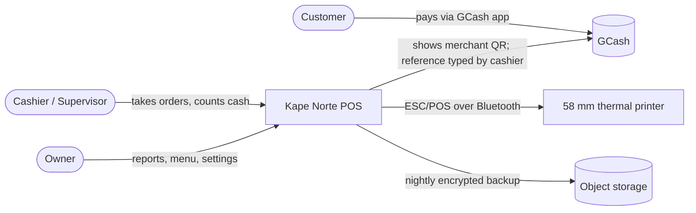
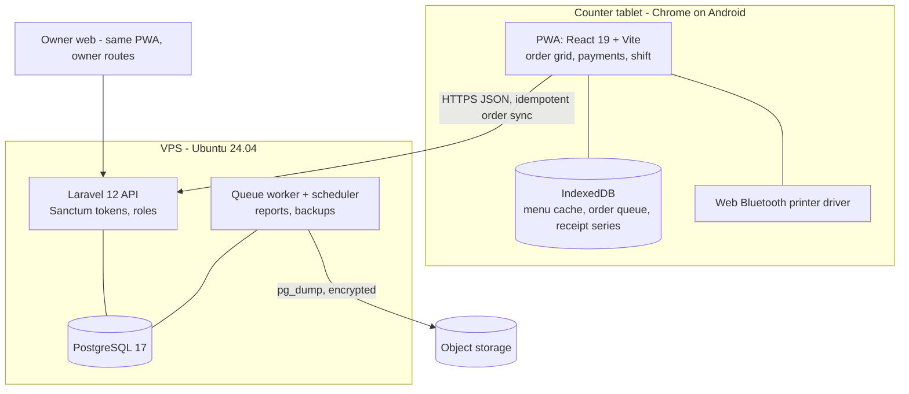
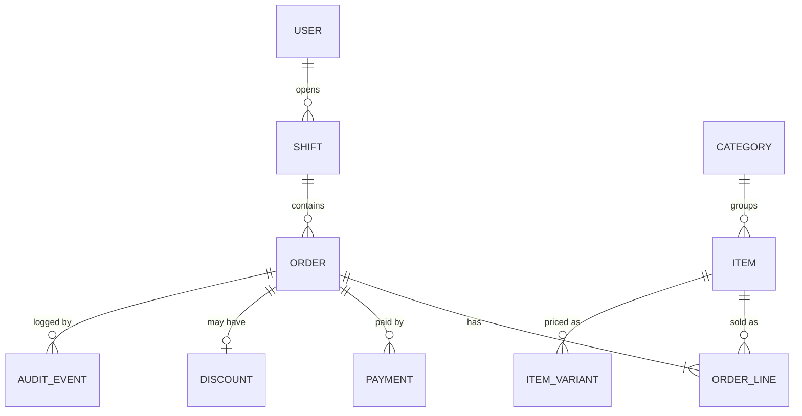

# Architecture

## Context

One counter tablet sells; the owner reads reports from anywhere; the internet at the café drops several times a week for minutes to hours. The architecture decision is recorded in ADR-001: an offline-capable PWA on the tablet, a Laravel API on a small VPS, and a Bluetooth receipt printer driven from the browser.

Quality drivers, in order: selling never stops (NFR-02), money is exact (NFR-06), checkout is fast (NFR-01), one developer can maintain it (NFR-05).

## System context (C4 level 1)

GCash is not integrated through an API: the customer scans the café's static QR and the cashier records the reference number (R-004).

## Containers (C4 level 2)

| Container | Responsibility | Technology |
|---|---|---|
| PWA | Order grid, payments, receipts, offline queue, shift screens, owner reports | React 19 + Vite, Workbox service worker, IndexedDB via Dexie |
| Printer driver | ESC/POS byte stream to the paired printer | Web Bluetooth (Chrome on Android) |
| API | Auth, menu, order sync, reports, settings | Laravel 12, PHP 8.4, Sanctum |
| Database | Orders, payments, shifts, menu, audit log | PostgreSQL 17 |
| Worker | Daily report snapshot at 20:30, nightly backup | Laravel queue + scheduler, Supervisor |

## Key flows

1. **Sell offline.** The PWA builds the order from the cached menu, computes totals with the shared rules, assigns the next receipt number from the device series, saves the order in IndexedDB with a client UUID, prints, and marks it queued. The sync loop posts queued orders to API-04 every 15 seconds while online; the server upserts by UUID and returns the stored order.
2. **Price change.** The owner edits a price (API-02); the tablet pulls the menu version every 60 seconds online (API-01). Orders keep the price captured at sale time.
3. **Shift close.** The supervisor enters the count (API-06); the server computes expected cash from synced cash payments and the float; if orders are still queued, the PWA blocks close until sync or explicit offline close (R-008).

## Technology choices

| Concern | Choice | Reason |
|---|---|---|
| Backend | Laravel 12 on PHP 8.4 | Developer's strongest stack; auth, queues, scheduler and tests built in |
| Frontend | React 19 PWA with Vite | Offline service worker and IndexedDB are first-class; Livewire needs a live server connection |
| Database | PostgreSQL 17 | Exact numeric handling, partial unique indexes for receipt series, reliable dumps |
| Offline store | IndexedDB (Dexie) | Survives reloads; holds 1,000+ orders easily |
| Printing | Web Bluetooth ESC/POS | No print server in the café; works offline; fixes the tablet to Chrome on Android |
| Hosting | 1 vCPU / 2 GB VPS (Singapore region), Nginx, Let's Encrypt | About ₱600 a month; latency from Cagayan acceptable for sync |
| Tests | Pest (API), Vitest (shared total rules, queue), Playwright (one offline checkout flow) | Covers the money paths named in DG-01 |

## Data model summary

| Entity | Key fields | Constraints and notes |
|---|---|---|
| users | id, name, role (cashier, supervisor, owner), pin_hash, password_hash | role checked on every endpoint; PIN unique per active user |
| shifts | id, opened_by, closed_by, float_centavos, counted_centavos, expected_centavos, opened_at, closed_at | one open shift at a time (partial unique index where closed_at is null) |
| orders | id (UUID from the client), receipt_series, receipt_no, shift_id, cashier_id, status (paid, void), subtotal_centavos, discount_centavos, vat_centavos, total_centavos, created_at, printed_at, synced_at | unique (receipt_series, receipt_no); UUID is the idempotency key |
| order_lines | id, order_id, item_variant_id, name_snapshot, unit_price_centavos, qty, modifiers (jsonb) | price and name captured at sale time |
| payments | id, order_id, method (cash, gcash), amount_centavos, tendered_centavos, gcash_ref | unique gcash_ref per business date |
| discounts | id, order_id, type (senior, pwd), holder_name, id_number, vat_exempt_centavos, amount_centavos | personal data: supervisor and owner only (NFR-04) |
| items, item_variants, categories | name, price_centavos, sold_out, sort | soft-delete; price history kept through order snapshots |
| audit_events | id, actor_id, action, subject, reason, created_at | append-only; voids, sign-in lockouts, price changes |

Retention: orders, payments and discounts are kept as long as the tax records require (the owner confirms the period with her accountant); audit events 2 years; backups 30 days.

## API summary

All endpoints are under `/api/v1`, JSON, authenticated with Sanctum tokens bound to a device, and return errors as `{ "error": { "code": "...", "message": "..." } }`.

| ID | Method and path | Purpose | Role | Serves |
|---|---|---|---|---|
| API-01 | GET /menu?since={version} | Menu, variants, modifiers, sold-out flags changed since a version | cashier+ | R-002, R-010 |
| API-02 | PUT /items/{id} | Edit an item, price or sold-out flag | supervisor (sold-out), owner (all) | R-010 |
| API-03 | POST /sessions/pin | PIN sign-in; lockout after 5 failures | device token | R-001 |
| API-04 | PUT /orders/{uuid} | Idempotent order upsert with lines, payments, discount | cashier+ | R-003, R-004, R-005, R-006, R-011 |
| API-05 | POST /orders/{uuid}/void | Void with supervisor PIN and reason | supervisor | R-007 |
| API-06 | POST /shifts, POST /shifts/{id}/close | Open and close a shift with counts | supervisor | R-008 |
| API-07 | GET /reports/daily?date= | Daily report | owner | R-009 |
| API-08 | GET /reports/export.csv?from=&to= | CSV export | owner | R-012 |

## Security notes

Server-side role checks on every endpoint (NFR-04); device tokens revocable from the owner screen; rate limit on API-03; SC/PWD fields excluded from logs and from the cashier's order history view; HTTPS only; secrets in `.env` on the server, never in the PWA bundle.

## Operations notes

Deploy by `git pull` + `php artisan migrate --force` behind a maintenance flag, outside café hours; nightly encrypted `pg_dump` to object storage; uptime check on `/api/v1/health` every 5 minutes; rollback = previous release folder + restore of the pre-deploy dump if a migration failed.
