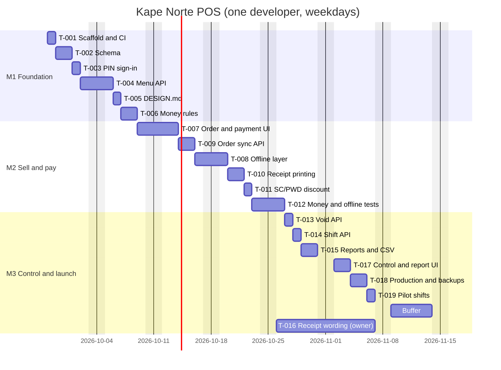

# Roadmap

## Approach

One developer, weekdays only, starting 2026-09-28. Estimates are developer days for a developer who knows Laravel and React. The dependency chain is schema, then shared money rules, then the selling screens, then offline sync, then control and reports. The riskiest unknown (Bluetooth printing) is tested on day 1 of T-010, not at the end.

Capacity: 30 estimated days of work + 5 days of buffer (about 17%) = 35 working days, launch on 2026-11-16. Buffer is held at the end of M3 and is only spent on work already in this plan.

Task format: `- [ ] **T-001** title`, then `owner`, `estimate`, `depends`, `covers` and a `verify` line that can fail. `/orchestrate docs/proplan/cafe-pos M1` builds a milestone.

## Milestones

### M1 Foundation and menu (weeks 1-2)

Exit: the owner can sign in, manage the menu, and the shared money rules pass their fixtures in CI.

- [ ] **T-001** Scaffold the repository: Laravel 12 API, React 19 PWA (Vite), Pest, Vitest, CI workflow, `composer setup`
  - owner: devops-engineer · estimate: 1d · depends: - · covers: NFR-05, DG-05
  - verify: a fresh clone runs `composer setup` then `composer test` and `npm test` with exit code 0; the CI run on the first push is green
- [ ] **T-002** Create migrations and models for users, shifts, categories, items, variants, orders, order lines, payments, discounts, audit events (03 data model summary)
  - owner: database-architect · estimate: 2d · depends: T-001 · covers: R-002, R-010, NFR-06
  - verify: `php artisan migrate:fresh --seed` exits 0; inserting two orders with the same (receipt_series, receipt_no) fails with a unique violation; opening a second shift while one is open fails
- [ ] **T-003** PIN sign-in with lockout, roles cashier/supervisor/owner, device tokens (API-03)
  - owner: backend-specialist · estimate: 1d · depends: T-002 · covers: R-001, NFR-04
  - verify: `php artisan test --filter=PinSignIn` passes, including the 6th-attempt lockout and a cashier token getting 403 on an owner route
- [ ] **T-004** Menu API with versioned sync and owner/supervisor edits (API-01, API-02)
  - owner: backend-specialist · estimate: 2d · depends: T-002, T-003 · covers: R-010, R-002
  - verify: `php artisan test --filter=Menu` passes; after a price edit, `GET /api/v1/menu?since=<old version>` returns only the changed item and past order lines keep the old price
- [ ] **T-005** Write DESIGN.md for the cashier and owner screens (tokens, type scale, touch targets, money display)
  - owner: frontend-specialist · estimate: 1d · depends: - · covers: NFR-03, NFR-01
  - verify: DESIGN.md exists with colour tokens whose text pairs pass 4.5:1 (checked with the contrast script) and a 44 px minimum target rule
- [ ] **T-006** Shared total, VAT and SC/PWD discount rules in PHP and TypeScript, both run against one JSON fixture file
  - owner: backend-specialist · estimate: 2d · depends: T-002 · covers: R-003, R-006, NFR-06, DG-01
  - verify: `composer test --filter=Totals` and `npm test -- totals` both pass the same 25 fixtures, including ₱168.00 SC line = ₱120.00 and a mixed SC + regular order

### M2 Sell and pay, online and offline (weeks 3-4)

Exit: a cashier completes cash, GCash, split and SC orders with the network off; they sync with no duplicates; receipts print.

- [ ] **T-007** Order grid with categories, modifiers, sold-out state; cash, GCash and split payment screens
  - owner: frontend-specialist · estimate: 3d · depends: T-004, T-005, T-006 · covers: R-002, R-003, R-004, NFR-01, NFR-03
  - verify: Playwright `checkout.spec.ts` completes a cash order (₱500 tendered on ₱185 shows ₱315 change) and a GCash order with a 13-digit reference; add-item p95 at or under 100 ms in the Chrome performance trace on the counter tablet
- [ ] **T-008** Offline layer: service worker, IndexedDB menu cache and order queue, sync loop every 15 s, pending counter
  - owner: frontend-specialist · estimate: 2d · depends: T-007 · covers: R-011, NFR-02
  - verify: with DevTools offline, 40 orders are taken and the counter shows 40; back online, all 40 reach the server within 5 minutes (server count = 40)
- [ ] **T-009** Idempotent order upsert by client UUID, device receipt series, duplicate GCash reference check (API-04)
  - owner: backend-specialist · estimate: 2d · depends: T-006 · covers: R-011, R-003, R-004, R-005, NFR-06
  - verify: `php artisan test --filter=OrderSync` passes: the same payload sent twice returns 200 both times and one row; a reused GCash reference on the same date returns 422 naming the earlier order
- [ ] **T-010** Receipt layout and Web Bluetooth ESC/POS driver with reprint; spike on the real printer on day 1
  - owner: frontend-specialist · estimate: 2d · depends: T-007 · covers: R-005
  - verify: on the counter tablet, a paid order prints all fields in R-005 AC1 on the 58 mm printer; with the printer off, the order saves, the banner shows, and Reprint works after power-on
- [ ] **T-011** SC/PWD discount dialog with required ID number and name, receipt discount lines
  - owner: frontend-specialist · estimate: 1d · depends: T-007, T-010 · covers: R-006, NFR-04
  - verify: Playwright `discount.spec.ts`: saving without the ID number shows "ID number and name are required"; a ₱168.00 SC item totals ₱120.00 on screen and on the printed receipt
- [ ] **T-012** Money-path and offline tests: Pest for totals, payments, sync; Playwright checkout with the network disabled; coverage report
  - owner: test-engineer · estimate: 2d · depends: T-008, T-009, T-011 · covers: R-011, R-003, R-004, R-006, NFR-05, DG-01, NFR-02
  - verify: CI green; coverage report shows at least 80% lines in app/Domain/Money and src/money; the offline Playwright spec passes 10 runs in a row

### M3 Control, reports and launch (weeks 5-7, including the buffer week)

Exit: voids and shift close work with supervisor PIN, the owner reads the report on her phone, production runs with tested backups, and a pilot shift matches the paper totals.

- [ ] **T-013** Void endpoint with supervisor PIN, reason list and audit event (API-05)
  - owner: backend-specialist · estimate: 1d · depends: T-009, T-003 · covers: R-007
  - verify: `php artisan test --filter=Void` passes: a supervisor PIN voids and logs both names; a cashier PIN in the supervisor field returns 403; the receipt number stays used
- [ ] **T-014** Shift open and close with float, denomination count and expected-cash computation (API-06)
  - owner: backend-specialist · estimate: 1d · depends: T-009 · covers: R-008
  - verify: `php artisan test --filter=Shift` passes the R-008 AC2 case (expected ₱10,450, counted ₱10,420, variance -₱30)
- [ ] **T-015** Daily report, 20:30 snapshot job and CSV export (API-07, API-08)
  - owner: backend-specialist · estimate: 2d · depends: T-009 · covers: R-009, R-012
  - verify: `php artisan test --filter=Report` passes: report totals equal the sum of non-void orders for a seeded day to the centavo; CSV opens in Excel with ₱ and Ñ intact (UTF-8 with BOM)
- [ ] **T-016** Confirm receipt wording and registered business details with the accountant; fill in receipt settings
  - owner: Liza Dela Cruz (human) · estimate: 0.5d of the owner's time · depends: T-010 · covers: R-005
  - verify: a printed sample receipt signed off by the accountant is saved in docs/receipt-approval.pdf before 2026-11-09
- [ ] **T-017** Void prompt, shift open/close and owner report screens (mobile-first for the owner's phone)
  - owner: frontend-specialist · estimate: 2d · depends: T-013, T-014, T-015 · covers: R-007, R-008, R-009, NFR-03
  - verify: Playwright `shift.spec.ts` and `report.spec.ts` pass at 390 px and 1280 px; axe reports no serious or critical issues on these screens
- [ ] **T-018** Production: VPS, Nginx, TLS, queue worker, nightly encrypted backup, restore drill, uptime check, README runbook
  - owner: devops-engineer · estimate: 2d · depends: T-001, T-012 · covers: NFR-06, NFR-04, DG-05
  - verify: `curl -fsS https://pos.kapenorte.ph/api/v1/health` returns ok; last night's backup restores into a scratch database with the same order count; README has the restore and printer pairing steps
- [ ] **T-019** Pilot: two real shifts with paper slips in parallel; compare totals, cash count and report
  - owner: test-engineer · estimate: 1d · depends: T-017, T-018, T-016 · covers: R-003, R-008, R-009, R-011
  - verify: pilot notes show POS totals equal the slip totals to the centavo for both shifts and the shift variance matches the manual count

Buffer: 5 days after T-019 (2026-11-09 to 2026-11-13). Launch 2026-11-16.

## Critical path

With one developer the work runs in sequence, so every task is on the calendar path. The dependency chain that cannot be reordered is:

T-001 → T-002 → T-006 → T-007 → T-010 → T-011 → T-012 → T-018 → T-019

A slip in T-010 (printer) or T-008/T-009 (sync) moves launch; everything in M3 except T-018 can be reordered.

## Risks

| ID | Risk | Likelihood | Impact | Mitigation | Owner |
|---|---|---|---|---|---|
| RK-01 | Web Bluetooth printing is unreliable with the chosen printer | Medium | High | Printer spike on day 1 of T-010; buy a model already tested with ESC/POS over BLE; fallback: RawBT print service via Android intent | frontend-specialist |
| RK-02 | Tablet or printer bought late or unsupported (not Chrome on Android) | Medium | High | Send the owner the exact models by 2026-10-05; M2 cannot start T-010 without them | Liza Dela Cruz (human) |
| RK-03 | Sync creates duplicate or lost orders | Low | High | Client UUID idempotency (T-009), 10-run offline Playwright test (T-012), pending counter blocks shift close | backend-specialist |
| RK-04 | Receipt wording not approved by the accountant in time | Medium | Medium | Start T-016 on 2026-10-26; if not approved by 2026-11-09, launch with the approved interim wording the accountant gives and keep the current receipt process alongside | Liza Dela Cruz (human) |
| RK-05 | Developer unavailable for several days | Low | Medium | 5-day buffer; README runbook and CI make handover possible | project-planner |

## Definition of done (every task)

- The verify line was run and its output is recorded in the task's PR or `/orchestrate` report.
- Tier per `code-rules`: money, auth, sync and migrations are tier 2 (full checks, tests, `/review`); UI-only tasks tier 1 with a look at 390 px and 1280 px.
- No task is marked done with a failing test in CI.
