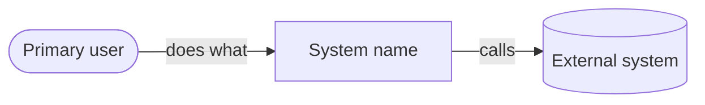
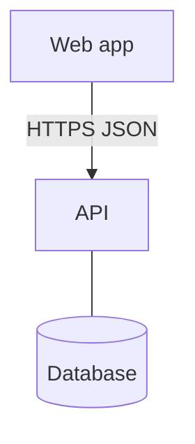

<!--
Owner: solution-architect (Phase 2). An arc42-lite description with C4 level 1-2 diagrams in mermaid.
IDs: none defined here in the full set; refer to NFR-xx for quality drivers and ADR-xxx for decisions.
Lite set only: this document also holds the "Data model summary" and "API summary" sections (API-01 ... defined as the first
cell of the API table, each row naming the R-ids it serves). In the full set delete those two sections; 04 and 05 own them.
Write for a developer who joins in month three: why the system is shaped this way, not only what it is.
Diagrams: mermaid `flowchart` for C4 (GitHub and Antigravity render it); keep each diagram under about 15 nodes.
-->

# Architecture

## Context and drivers

<!--
- What the system must do in one paragraph (link the key R-ids).
- Quality drivers in priority order, each an NFR id: "selling never stops (NFR-02) > money is exact (NFR-06) > fast checkout (NFR-01)". When two drivers conflict, the order decides.
- Constraints that shaped the design: team size and skills, budget, hosting, devices, existing systems.
-->

## System context (C4 level 1)

<!-- People and external systems around the system, with what flows between them. -->

## Containers (C4 level 2)

<!-- Deployable units: web app, API, database, worker, mobile app, third-party services. Then one row per container. -->

| Container | Responsibility | Technology |
|---|---|---|
| | | |

## Components

<!-- Only for the container where the complexity lives (usually the API or the offline client). Name the modules and their responsibilities; say which module owns which R-ids. Skip for a simple CRUD app. -->

## Integrations

<!-- Every external system: payments (GCash, Maya, PayMongo), SMS, email, maps, government systems, printers, identity providers. -->

| System | Direction | Protocol and auth | Data | Failure mode and fallback |
|---|---|---|---|---|
| | | | | |

## Key flows

<!-- The 2-5 flows that carry the risk (payment, sync, approval, import). Numbered steps or a mermaid sequenceDiagram. Include what happens when a step fails. -->

## Technology stack

<!-- Each choice with the reason for THIS project. The project's existing stack and the team's skills win over fashion. -->

| Concern | Choice | Reason |
|---|---|---|
| | | |

## Cross-cutting concepts

<!-- One short paragraph each where relevant: authentication and sessions, authorization, validation, error handling, logging, configuration, time zones (Asia/Manila), money and rounding, localisation, file storage. -->

## Architecture decisions

<!-- List every ADR with its one-line decision. The reasoning lives in adr/ADR-NNN-slug.md. -->

| ADR | Decision | Status |
|---|---|---|
| ADR-001 | | accepted |

## Deployment view

<!-- Where each container runs (VPS, shared hosting, Vercel, on-site PC), regions, domains. Details in 09-operations. -->

## Technical risks and debt

<!-- Risks created by the architecture itself (new technology, single points of failure, vendor lock-in). Put the managed ones in 11-risks with RK ids. -->

## Data model summary

<!-- LITE SET ONLY (delete in the full set). Mermaid erDiagram of the main entities, then a table: entity, key fields, constraints and notes. State retention. -->

## API summary

<!-- LITE SET ONLY (delete in the full set). One row per endpoint; the ID is the first cell. -->

| ID | Method and path | Purpose | Role | Serves |
|---|---|---|---|---|
| API-01 | | | | R-001 |
