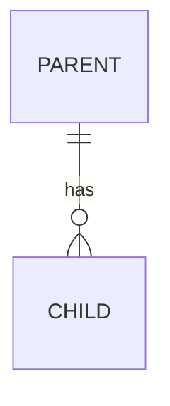

<!--
Owner: database-architect (Phase 3). Input: 02-requirements, 03-architecture, ADRs.
IDs: none defined here. Refer to the R-ids a table supports and to NFR-xx for integrity, privacy and retention.
Aim: a developer can write the migrations from this document without asking questions.
Write constraints in the database, not only in the application: NOT NULL, UNIQUE, CHECK, foreign keys with a deliberate ON DELETE.
-->

# Data Model

## Conventions

<!--
State once, then do not repeat per table:
- Table and column naming (snake_case plural tables, singular models).
- Primary keys (bigint identity, or UUID when clients create records offline or ids are exposed publicly).
- Timestamps (created_at, updated_at, stored in UTC, displayed in Asia/Manila).
- Soft delete or not, and for which tables.
- Money as integer centavos (or numeric(12,2)); never float.
- Enumerations as text with CHECK, or lookup tables; say which.
-->

## Entities

<!-- One line per entity: what it represents in the client's words, and the R-ids that need it. -->

## Entity relationship diagram

## Tables

<!-- One subsection per table. Keep the three parts: columns, indexes, constraints. -->

### table_name

| Column | Type | Null | Default | Notes |
|---|---|---|---|---|
| id | bigint identity | no | | primary key |

Indexes:
<!-- Each index with the query it serves: "orders (shift_id, created_at) - shift report". No index without a query. -->

Constraints:
<!-- Unique, check and foreign key rules with ON DELETE behaviour and why. -->

## Enumerations and reference data

<!-- Allowed values, who can change them, seed data. -->

## Data lifecycle and retention

<!-- For each kind of record: how long it is kept, why (tax records, audit, RA 10173 purpose limitation), how it is disposed of (delete, anonymise, archive). -->

| Data | Retention | Reason | Disposal |
|---|---|---|---|
| | | | |

## Personal data inventory

<!-- Every column holding personal or sensitive personal information, its purpose and who may read it. 07-security uses this list. -->

## Volumes and growth

<!-- Rows per day or month for the big tables, size after 3 years, the query that will get slow first and its plan. -->

## Migrations and seed data

<!-- Migration order, how existing data is imported (spreadsheet, old system), seed data for development and for production (roles, settings), and the rollback approach for each risky migration. -->
