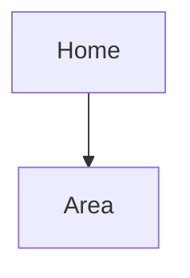

<!--
Owner: ux-architect (Phase 1 discovery notes, Phase 3 full document).
IDs defined here:
  S-01 ...  screens, defined as the FIRST CELL of the screen inventory table, each row naming the R-ids it serves.
Wireframe spec headings must not start with the ID (use "### Wireframe: S-01 Order screen"), or the checker reports a duplicate definition.
This document describes structure, flow, content and states. Visual style (colours, type, spacing) goes to DESIGN.md; this document
only sets its direction. The builder (frontend-specialist, mobile-developer) should be able to build each screen from its spec
without inventing states or flows.
-->

# UX

## Users and contexts

<!-- For each persona in 02: device and screen size, environment (bright counter, noisy office, field with weak signal), frequency of use, time pressure, language, accessibility needs. These decide layout density and target sizes. -->

## Design direction

<!--
Direction for DESIGN.md (written with the `design-spec` skill during the build, or now if the client wants to approve the look early):
- Tone and personality in 3-5 words the client agreed to (e.g. "calm, precise, local, warm").
- Density: dense data screens or spacious public pages.
- Type approach, colour approach (brand colours if the client has them), imagery, motion.
- References the client likes, and what to take from each.
- Defaults to question (from the `anti-template` skill): the generic hero with a gradient blob, three identical feature cards, stock illustrations. Use any of them when the brief calls for it.
Accessibility is not a style choice: WCAG level from 01/02 applies whatever the direction.
-->

## Information architecture

<!-- Sitemap: every area and screen, grouped by role. Mermaid flowchart or an indented list. Mark which screens each role can reach. -->

## User journeys

<!-- 3-6 journeys for the primary personas, end to end, including where they come from and what happens after. Each step: what the user wants, what they do, what the system shows, what can go wrong. Name the screens by S-id. -->

## Screen inventory

<!-- Every screen or distinct view. States column: which of empty, loading, error, offline, permission-denied, partial data apply. -->

| ID | Screen | Route | Roles | Serves | States |
|---|---|---|---|---|---|
| S-01 | | | | R-001 | |

## Key flows

<!-- The flows that carry the risk or the volume (checkout, registration, approval). Mermaid flowchart with the error branches, not only the happy path. -->

## Wireframe specs

<!--
One subsection per key screen (all Must screens for a small system). Text wireframe, not a picture:
- Purpose: the one job of the screen.
- Layout: regions top to bottom (mobile) and how they rearrange at desktop width.
- Content and components: in priority order; primary action named with its exact label.
- States: empty, loading, error, offline, permission denied; what each shows and the way out.
- Validation and messages: exact copy for errors that matter.
- Accessibility: focus order, labels, keyboard path, live regions for async updates.
-->

### Wireframe: S-01 <Screen name>

## Content and microcopy

<!-- Voice for system text (plain, specific, no hype), language(s), date/money formats (₱1,234.50; 27 Sep 2026), terms to use consistently (link 13-glossary). Buttons say what they do. -->

## Accessibility target

<!-- WCAG level, minimum touch target, contrast, reduced motion, screen reader support for the key flows, how it is tested (08). -->
